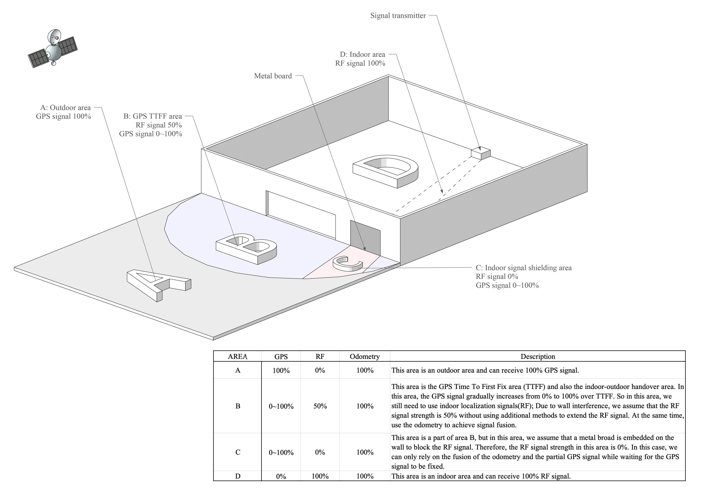
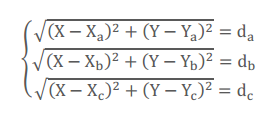
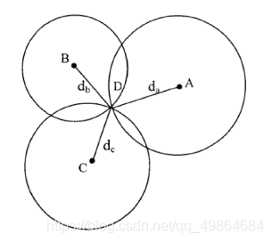
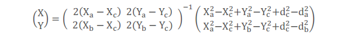
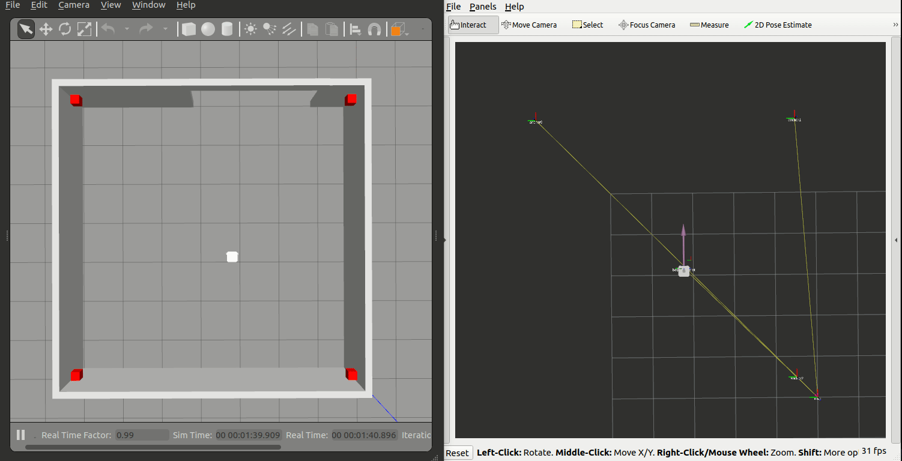

## Mobile robot indoor-outdoor localization handover guideline 

### 1. Environment

- Ubuntu ： 22.04 LTS
- ROS2 ： Humble
- Simulation software : Gazebo 11
- Robot: turtlebot3

### 2. Objective

Design an indoor-outdoor mobile robot localization system utilizing the open-source robot_localization package for multi-sensor fusion-based localization. The robot should provide data from wheel odometry (odom), IMU inertial navigation, outdoor GPS, indoor UWB, and optionally, laser odometry. All sensor data are fused in robot_localization using EKF/UKF for localization. During localization, it should switch between appropriate auxiliary localization data sources based on the signal strength of GPS and UWB. The project will first verify the localization system framework using the Turtlebot3 robot model in the Gazebo simulation environment, and later it will be implemented and applied on a physical robot.

### 3. System

#### 3.1 Scenario

As shown in the figure below, the scene is divided into four areas, A, B, C, and D. The GPS and UWB signal strengths vary in each area. Thus, it is necessary to switch between GPS or UWB signals as auxiliary localization data in different areas, while the wheel odometry (odom) and IMU data remain constant.

- In areas B & D, UWB signals are combined with odom for fused localization.
- In area C, metal obstructions block UWB signals, so only partial GPS signals combined with odom are used for fused localization.
- In area A, GPS signals are combined with odom for localization.




#### 3.2 System Architecture

The main focus of this system architecture is multi-sensor fusion, with particular emphasis on indoor and outdoor UWB and GPS data switching. Here, we write a node that receives UWB and GPS data and integrates this data based on signal strength (in simulation according to the area, and in reality according to actual signal strength). This node then publishes an Odometry/uwb2gps odometer data for EKF to carry out fused localization. It's also essential to consider the data conversion between UWB and GPS relative to the map. 


The entire localization process comprises two distinct steps:
##### Primary localization 
  Objective: To position the robot with its center as the origin of the body frame, using the world frame as a reference.
  How: We use an EKF, integrating data from UWB, GPS, Odometry, and IMU. The Kalman gain relies on the individual noise covariance of each signal, producing a relatively accurate result.
  Challenge: There's a time gap between consecutive GPS data transmissions, leading to a momentary discontinuity.
##### Secondary Localization
  Objective: To address the discontinuity caused by the GPS data gap.
  How: We now consider the robot's last position as the reference frame's origin and use the base link frame in place of the previous body frame. For the robot's subsequent movement, position is sourced from Odometry and IMU, and then integrated using EKF. This process continues until the next GPS data point is available.
  Result: By sequentially combining these two transformations, we get a comprehensive location for the given period.
##### Advantages:
  The first step, with GPS and UWB, ensures accurate localization.
  The second step, leveraging Odometry and IMU, addresses the discontinuity caused by GPS signals.
  When the subsequent GPS/UWB data becomes available, it corrects the cumulative errors introduced by IMU and Odometry.


In essence, this two-step approach overcomes the inherent drawbacks of each sensor, ensuring that we consistently obtain accurate and continuous localization data.


## UWB Localization

- [gazebo plugin ](https://github.com/GiacomoCorradini/uwb_gazebo_plugin) plugin

The principle of UWB positioning - Reference link: (https://blog.csdn.net/qq_49864684/article/details/115870377)

- Distance = Speed of light * Time difference / 2;
- In the XY plane, 3 circles can determine a point;
- In the XYZ space, 4 circles can determine a spatial point.

### ### I.The Principle and Calculation Method of Trilateration (TDOA Plane)

The principle of trilateration is illustrated in the figure on the right. Taking three nodes A, B, and C as the centers of circles, with coordinates (Xa, Ya), (Xb, Yb), and (Xc, Yc) respectively, these three circles intersect at point D. Intersection point D represents the mobile node, while A, B, and C represent the reference nodes. The distances from A, B, and C to the intersection point D are da, db, and dc respectively. Assuming the coordinates of intersection point D are (X, Y).



As shown in the figure：



The coordinates of the intersection point D can be obtained as:




### II. C++ Implementation

#### 2.1 Source Code

By utilizing the known coordinates of three base stations and the distances from these three base stations to an unknown point, the coordinates of the unknown point can be determined. Create a new file named test.cpp with the following content. The position coordinates of the base stations and the distance from the tag to the base station are based on the initial position information when the gazebo simulation environment is started:

Note: This parsing algorithm code is modified from the open-source code provided by the Decawave company.

```cpp
#include <stdio.h>
#include <string.h>
#include <math.h>
//#include <stdlib.h>
#include <math.h>

struct point_t
{
	double x, y;
};

struct circle_t
{
	struct point_t center;
	double r;
};

int double_equals(double a, double b)
{
	static const double ZERO = 1e-9;
	return fabs(a - b) < ZERO;
}

double distance_sqr(struct point_t* a, struct point_t* b)
{
	return (a->x - b->x) * (a->x - b->x) + (a->y - b->y) * (a->y - b->y);
}

double distance(struct point_t* a, struct point_t* b)
{
	return sqrt(distance_sqr(a, b));
}

int insect(struct circle_t circles[], struct point_t points[])
{
	double d, a, b, c, p, q, r;
	double cos_value[2], sin_value[2];
	if (double_equals(circles[0].center.x, circles[1].center.x)
		&& double_equals(circles[0].center.y, circles[1].center.y)
		&& double_equals(circles[0].r, circles[1].r))
	{
		return -1;
	}

	d = distance(&circles[0].center, &circles[1].center);
	if (d > circles[0].r + circles[1].r
		|| d < fabs(circles[0].r - circles[1].r))
	{
		return 0;
	}

	a = 2.0 * circles[0].r * (circles[0].center.x - circles[1].center.x);
	b = 2.0 * circles[0].r * (circles[0].center.y - circles[1].center.y);
	c = circles[1].r * circles[1].r - circles[0].r * circles[0].r
		- distance_sqr(&circles[0].center, &circles[1].center);
	p = a * a + b * b;
	q = -2.0 * a * c;
	if (double_equals(d, circles[0].r + circles[1].r)
		|| double_equals(d, fabs(circles[0].r - circles[1].r)))
	{
		cos_value[0] = -q / p / 2.0;
		sin_value[0] = sqrt(1 - cos_value[0] * cos_value[0]);

		points[0].x = circles[0].r * cos_value[0] + circles[0].center.x;
		points[0].y = circles[0].r * sin_value[0] + circles[0].center.y;

		if (!double_equals(distance_sqr(&points[0], &circles[1].center),
			circles[1].r * circles[1].r))
		{
			points[0].y = circles[0].center.y - circles[0].r * sin_value[0];
		}
		return 1;
	}

	r = c * c - b * b;
	cos_value[0] = (sqrt(q * q - 4.0 * p * r) - q) / p / 2.0;
	cos_value[1] = (-sqrt(q * q - 4.0 * p * r) - q) / p / 2.0;
	sin_value[0] = sqrt(1 - cos_value[0] * cos_value[0]);
	sin_value[1] = sqrt(1 - cos_value[1] * cos_value[1]);

	points[0].x = circles[0].r * cos_value[0] + circles[0].center.x;
	points[1].x = circles[0].r * cos_value[1] + circles[0].center.x;
	points[0].y = circles[0].r * sin_value[0] + circles[0].center.y;
	points[1].y = circles[0].r * sin_value[1] + circles[0].center.y;

	if (!double_equals(distance_sqr(&points[0], &circles[1].center),
		circles[1].r * circles[1].r))
	{
		points[0].y = circles[0].center.y - circles[0].r * sin_value[0];
	}
	if (!double_equals(distance_sqr(&points[1], &circles[1].center),
		circles[1].r * circles[1].r))
	{
		points[1].y = circles[0].center.y - circles[0].r * sin_value[1];
	}
	if (double_equals(points[0].y, points[1].y)
		&& double_equals(points[0].x, points[1].x))
	{
		if (points[0].y > 0)
		{
			points[1].y = -points[1].y;
		}
		else
		{
			points[0].y = -points[0].y;
		}
	}
	return 2;
}

void Cross_Point(struct circle_t circles[], struct point_t Location[])
{
	int cross_num = 5;
	struct point_t cross_points[2];
	cross_num = insect(circles, cross_points);// 0 1

	if (cross_num == 2)
	{
		double points_AC_0 = distance(&cross_points[0], &circles[2].center);
		double points_AC_1 = distance(&cross_points[1], &circles[2].center);

		if (abs((int)(points_AC_0 - circles[2].r) )< abs((int)(points_AC_1 - circles[2].r)))//cross_point[0]
		{
			Location[0].x = cross_points[0].x;
			Location[0].y = cross_points[0].y;
		}
		else
		{
			Location[0].x = cross_points[1].x;
			Location[0].y = cross_points[1].y;
		}

	}
	else if (cross_num == 1 || cross_num == 0)
	{
		Location[0].x = cross_points[0].x;
		Location[0].y = cross_points[0].y;
	}
}

struct point
{
	float x, y;
};

float norm(struct point p) // get the norm of a vector 求向量的范数
{
	return pow(pow(p.x, 2) + pow(p.y, 2), .5);
}

void trilateration_1(struct point point1, struct point point2, struct point point3, double r1, double r2, double r3) {
	struct point resultPose;
	// unit vector in a direction from point1 to point 2  
	double p2p1Distance = pow(pow(point2.x - point1.x, 2) + pow(point2.y - point1.y, 2), 0.5);
	struct point ex = { (point2.x - point1.x) / p2p1Distance, (point2.y - point1.y) / p2p1Distance };
	struct point aux = { point3.x - point1.x,point3.y - point1.y };
	// signed magnitude of the x component  
	double i = ex.x * aux.x + ex.y * aux.y;
	// the unit vector in the y direction.  
	struct point aux2 = { point3.x - point1.x - i * ex.x, point3.y - point1.y - i * ex.y };
	struct point ey = { aux2.x / norm(aux2), aux2.y / norm(aux2) };
	// the signed magnitude of the y component  
	double j = ey.x * aux.x + ey.y * aux.y;
	// coordinates  
	double x = (pow(r1, 2) - pow(r2, 2) + pow(p2p1Distance, 2)) / (2 * p2p1Distance);
	double y = (pow(r1, 2) - pow(r3, 2) + pow(i, 2) + pow(j, 2)) / (2 * j) - i * x / j;
	// result coordinates   
	double finalX = point1.x + x * ex.x + y * ey.x;
	double finalY = point1.y + x * ex.y + y * ey.y;
	resultPose.x = finalX;
	resultPose.y = finalY;

	printf("TAG LOC :x = %3.2f,y = %3.2f\r\n", resultPose.x, resultPose.y);

}

int main()
{
	struct point points[3];
	// Anchor 1
	points[0].x= 6.8;
	points[0].y = 6.8;
	double r1 = 4.954; 	// The distance between anchor and tag
	// Anchor 2
	points[1].x = 6.8;
	points[1].y = 0.5;
	double r2=4.429;	
	// Anchor 3
	points[2].x = 0.5;
	points[2].y = 6.8;
	double r3 = 4.424;	
	// Calculate the coordinate of tag
	trilateration_1(points[0], points[1], points[2], r1, r2, r3);

	return 0;
}
```


#### 2.2 Compilation & Execution

```sh
# 1 - compile cpp file
g++ test.cpp -o test
# 2 - execute 
./test
# test result , The robot's position coordinates set in Gazebo are (3.2, 3.2), with an error of about 6cm.
TAG LOC : x = 3.26,y = 3.26
```


## Launch

First, add the following commands to the .bashrc file, making sure to adjust to your own workspace path:

```sh
# turtlebot3 gazebo
export GAZEBO_MODEL_PATH=$GAZEBO_MODEL_PATH:~/localization_ws/src/turtlebot3_simulations/turtlebot3_gazebo/models
export GAZEBO_PLUGIN_PATH=$HOME:~/localization_ws/build/uwb_gazebo_plugin:$GAZEBO_PLUGIN_PATH
export TURTLEBOT3_MODEL=waffle

```


#### 1.1 Compilation

```sh
# Install
sudo apt install ros-humble-gazebo-ros-pkgs
sudo apt install libignition-math6-dev
sudo apt  install libgazebo-dev
# Compile
colcon build
```

#### 1.2 Execution

```sh
# 1 - gazebo
ros2 launch turtlebot3_gazebo turtlebot3_uwb_gps.launch.py
# 2 - ekf
ros2 launch robot_localization dual_ekf_navsat_gps_uwb.launch.py
# 3 - rviz2
rviz2 -d ~/Localization_handover/src/turtlebot3_simulations/turtlebot3_gazebo/rviz/tb3_gazebo_robot_localization.rviz
# 4 - Keyboard control
ros2 run teleop_twist_keyboard teleop_twist_keyboard
# 5 - Visualization
ros2 launch robot_utils robot_utils.launch.py
#### 1.3 Obtain param

Directly read the "param" parameters from the ekf_filter_node_map node to obtain the current covariance parameters and positioning mode in the EKF.

```sh
# 1 - initial_estimate_covariance
ros2 param get /ekf_filter_node_map initial_estimate_covariance
# 2 - process_noise_covariance
ros2 param get /ekf_filter_node_map process_noise_covariance
# 3 - location_mode
ros2 param get /ekf_filter_node_map location_mode 
```

#### 1.4 Switching Covariance Parameters and Positioning Mode

For now, we use the method of initiating client requests from the terminal to switch covariance parameters and positioning mode. Later, we will judge the noise level of UWB and GPS in a separate node program to thereby switch the covariance parameters and positioning mode.

```sh
ros2 service call /switch_localization_mode robot_localization/srv/Switch "new_process_noise_covariance:
- 0.05
- 0.05
- 0.06
- 0.03
- 0.03
- 0.06
- 0.025
- 0.025
- 0.04
- 0.01
- 0.01
- 0.02
- 0.01
- 0.01
- 0.015
new_initial_estimate_covariance:
- 0.01
- 0.01
- 0.01
- 0.01
- 0.01
- 0.01
- 0.01
- 0.01
- 0.01
- 0.01
- 0.01
- 0.01
- 0.01
- 0.01
- 0.01
location_mode: 'outdoor'"
```



